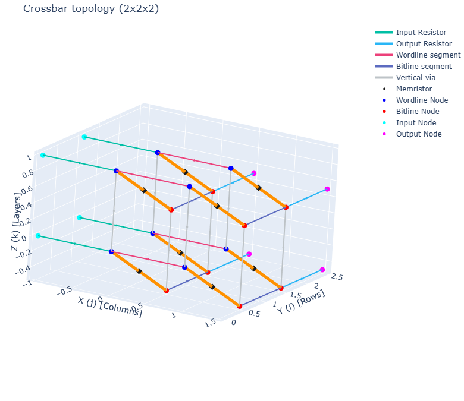
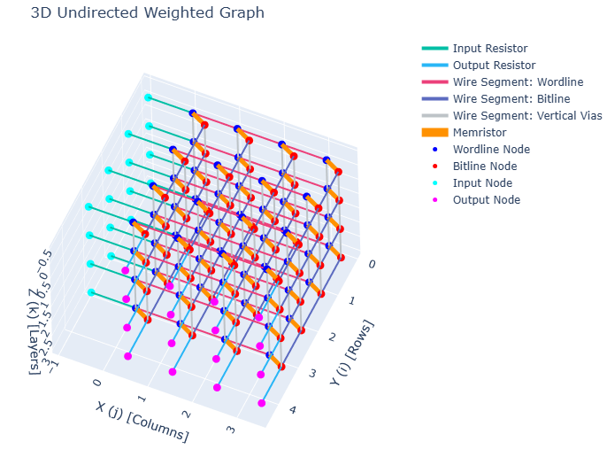
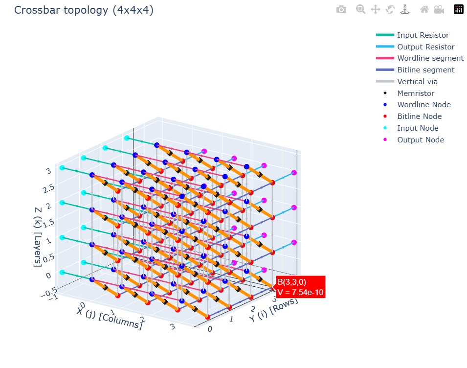
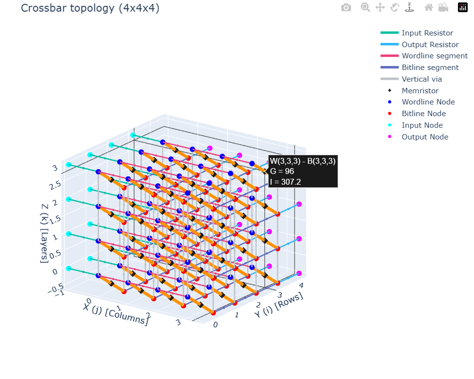

# TBarSim

A Python simulator for a **3D memristor crossbar array** (the "TBar" architecture), solved via nodal analysis (Kirchhoff's Current Law). The main module is [`crossbar.py`](crossbar.py), which defines the `Tbar` class for building the 3D graph, assigning memristor conductances and bias voltages, solving the circuit for every node voltage and branch current, and visualizing the result interactively in 3D.

## What it looks like

`Tbar` builds an `n x m x p` crossbar as a graph: each memristor sits between a **wordline node (W)** and a **bitline node (B)**; wordlines and bitlines are connected to their neighbors by wire segments, layers are joined by vertical vias, and each row/column has an **input (I)** or **output (O)** terminal. Calling `.show()` renders this structure interactively in Plotly, color-coded by element type.

<table align="center">
<tr>
<td align="center" width="50%">
<br>
<i>A minimal 2x2x2 TBar — small enough to see every node and edge type individually.</i>
</td>
<td align="center" width="50%">
<br>
<i>A solved 4x4x4 TBar, after <code>randomize_conductances()</code>, <code>set_bias()</code>, and <code>solve()</code>.</i>
</td>
</tr>
</table>

> **Note:** In the actual app, `.show()` opens this as an **interactive** Plotly figure — you can orbit it in 3D and hover over any node or memristor to read its solved voltage/current directly. The two topology images above are static renders of that same layout/color scheme for the README; the two hover screenshots below are genuine captures straight from `cb.show()`.

Hovering a **node** shows its solved voltage; hovering a **memristor edge** shows its conductance and the current flowing through it:

<table align="center">
<tr>
<td align="center" width="50%">
<br>
<i>Hovering B(3,3,0) reads its nodal voltage directly off the graph.</i>
</td>
<td align="center" width="50%">
<br>
<i>Hovering the memristor between W(3,3,3) and B(3,3,3) shows its conductance (G) and solved current (I).</i>
</td>
</tr>
</table>

`solve()` and `show()` also print a status readout to the console, e.g.:

```
--- Crossbar status (3x3x3) ---
Graph: 72 nodes, 117 edges
Conductances: all 27 memristors set (range 17 - 97).
Input bias: 9/9 nodes set.
Output bias: 9/9 nodes set.
Solved. Use get_voltage(node) / get_current(u,v), or show() to view results.
----------------------------------------
```

## Features

- Builds a full 3D crossbar topology (`n x m x p`) as a NetworkX graph: wordlines, bitlines, vertical vias, and input/output terminals
- Bulk (`set_conductances`) or per-device (`set_conductance`) memristor conductance assignment, plus random fill (`randomize_conductances`)
- Bulk (`set_input_voltages` / `set_output_voltages`) or per-node (`set_input_voltage` / `set_output_voltage`) bias assignment, or a single uniform bias for everything (`set_bias`)
- Configurable parasitics: input/output resistance and wire/via resistance
- Solves the full nodal (KCL) system with sparse linear algebra (`scipy.sparse.linalg.spsolve`)
- Retrieve any solved node voltage or branch current directly (`get_voltage`, `get_current`)
- Interactive 3D visualization of the topology, with hoverable voltages/currents once solved (`show`)
- A status readout (`is_ready_to_solve`, printed via `show`/`solve`) telling you exactly what's left to configure

## Requirements

- Python 3.10+ (uses `typing.Self`)
- `numpy`
- `networkx`
- `plotly`
- `scipy`

## Installation

```
git clone https://github.com/sadhu-bonik/TbarSim.git
cd TbarSim
python -m pip install numpy networkx plotly scipy
```

If you'd like an isolated environment, create and activate a virtual environment first, then install the dependencies there.

## Quick Start

```python
from crossbar import Tbar

# Build a 3x3x3 TBar (rows x columns x layers)
cb = Tbar(n=3, m=3, p=3)

# Assign memristor conductances (Siemens)
cb.randomize_conductances(low=10, high=100, seed=42)

# Apply a uniform bias: 3.2V on every input, 0V on every output
cb.set_bias(vin=3.2, vout=0.0)

# Solve the nodal (KCL) system
cb.solve()

# Query results
print(cb.get_voltage("W(0,0,0)"))
print(cb.get_current("W(0,0,0)", "B(0,0,0)"))

# Interactive 3D visualization
cb.show()
```

## Method Reference

##### Construction & parasitics

| Method | Description |
| --- | --- |
| `Tbar(n, m, p, S=1e12, L=1e12, GW=1e12)` | Builds the `n x m x p` crossbar graph. `S`/`L` are input/output conductance, `GW` is wire/via conductance (all near-ideal by default). |
| `set_parasitic_resistance(RW)` | Sets wire/via conductance from a resistance value (`GW = 1/RW`). |
| `set_parisitic_conductance(GW)` | Sets wire/via conductance directly. |
| `set_input_resistance(S)` / `set_output_resistance(L)` | Sets input/output conductance from a resistance value. |
| `set_input_conductance(S)` / `set_output_conductance(L)` | Sets input/output conductance directly. |

##### Memristor conductances

| Method | Description |
| --- | --- |
| `set_conductances(matrix)` | Bulk-assigns all memristor conductances from a `(p, n, m)` array. |
| `set_conductance(i, j, k, value)` | Sets a single memristor's conductance at row `i`, column `j`, layer `k`. |
| `randomize_conductances(low=0, high=100, seed=None, only_unset=True)` | Fills memristor conductances with random integers; by default only fills cells not already set. |

##### Bias voltages

| Method | Description |
| --- | --- |
| `set_input_voltages(matrix)` / `set_output_voltages(matrix)` | Bulk-assigns all input/output bias voltages from an `(n, p)` / `(m, p)` array. |
| `set_input_voltage(i, k, value)` / `set_output_voltage(j, k, value)` | Sets a single input/output node's bias voltage. |
| `set_bias(vin=None, vout=None, only_unset=False)` | Applies a uniform voltage to all input and/or output nodes. |

##### Solving & results

| Method | Description |
| --- | --- |
| `is_ready_to_solve()` | Returns `True` if all conductances and bias voltages are set. |
| `solve()` | Builds and solves the sparse KCL linear system for every node voltage, then annotates every edge with its current. Returns `self`. |
| `solved` (property) | `True` once `solve()` has run successfully. |
| `get_voltage(node_name)` | Returns the solved voltage at a node, e.g. `"W(0,0,0)"`, `"I(1,0)"`. |
| `get_current(u, v)` | Returns the solved current between two adjacent nodes. |
| `show()` | Prints a status readout and opens an interactive 3D Plotly figure of the topology (with solved values on hover, if solved). Returns the `Figure` object. |

## Node Naming Convention

- `W(i,j,k)` — wordline node at row `i`, column `j`, layer `k`
- `B(i,j,k)` — bitline node at row `i`, column `j`, layer `k`
- `I(i,k)` — input terminal at row `i`, layer `k`
- `O(j,k)` — output terminal at column `j`, layer `k`

Each memristor connects a `W(i,j,k)` node to its corresponding `B(i,j,k)` node.

## Notes

- `solve()` must be called only after conductances and bias voltages are fully specified (check with `is_ready_to_solve()` — `show()` will print exactly what's missing).
- `show()` opens an interactive Plotly figure; the images in this README are static captures of that same topology and color scheme.
- Coordinates follow `n` = rows (wordlines), `m` = columns (bitlines), `p` = layers.

## License

See [LICENSE](LICENSE) if included, or add one appropriate for your project (e.g. MIT, Apache 2.0).

## Contact

*Adib Kadir & Thongum Athoiba*